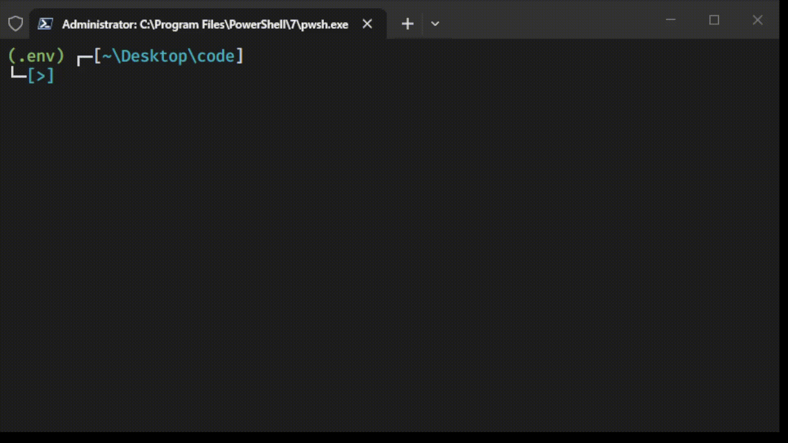

# ASSESMENT PROJECT

## INTRODUCTION
As per the design guide this project has threshold setting and voltage and current measurement functionality, and depending on the ADC reading for Voltage or Current if they exceed the threshold rating then it trigegrs/flips the relay pin to low(disconnecting). And after that even if the voltage or current rating in supply line comes below the threshold limit. For safety reason I am made them not to trigger the RELAY to CONNECTED or HIGH state. After any surge current or voltage if the user wants to reset the RELAY PIN's STATE, then he can use RESET command.

## Commands List
```text
- THRESHOLD_VOLTAGE_0.00      Ex: 0.00 can be the threshold voltage value like 220.00   Unit(V)
- THRESHOLD_CURRENT_0.00      Ex: 0.00 can be the threshold current calue like 1.0      Unit(A)
- ADC_READOUT_VOLTAGE_0.00    Ex: 0.00 can be the current voltage(V) reading from supply
- ADC_READOUT_CURRENT_0.00    Ex: 0.00 can be the current current(A) reading from supply
- RESET_RELAY                 Ex: This one sets the RELAY PIN to HIGH, independent of any condition.
```

## Extra Requirements
- arduino-cli in the global path : this project uses arduino-cli to compile the code. Video attached.

## Setup Instructions
> commands needed
```bash
git clone https://github.com/Aniruddh5502/Assesment-Project.git
cd Assesment-Project
pip install -r requirements.txt
python -m project_files.cli
```

## Project Structure
- sketch/            #  ESP32 firmware source code.
- project_files/     #  Python simulation and management tools.
- tests/             #  Automated tests.
- test_evidence      #  records of logs in md file
- .gitignore         #  __pycache__/ specificly.. Nothing else    